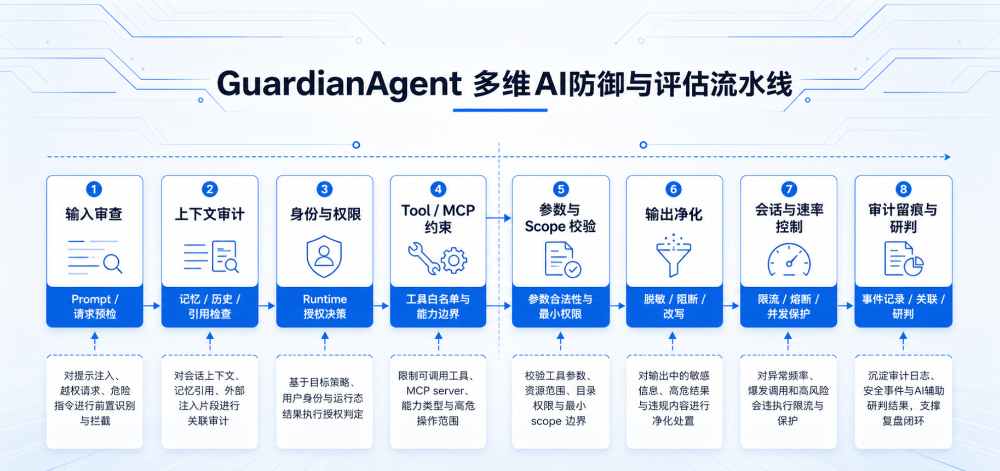
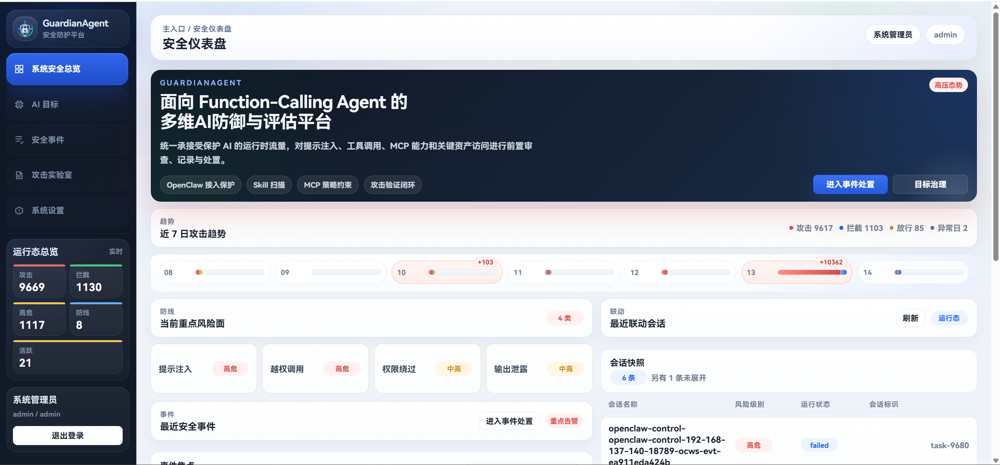
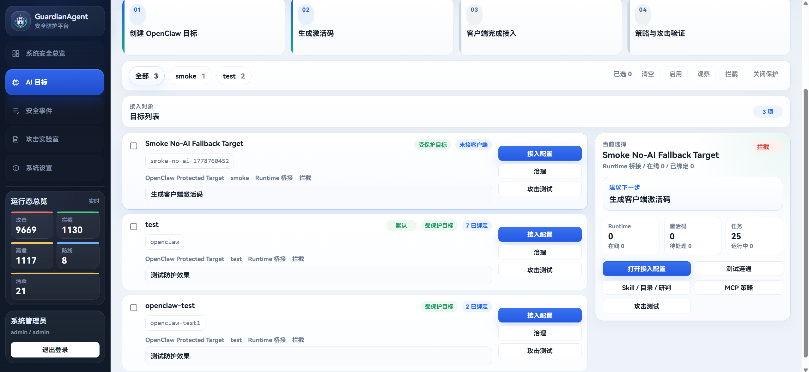
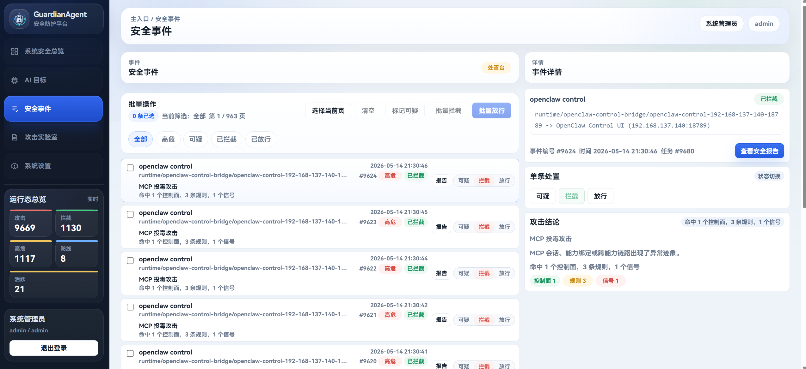
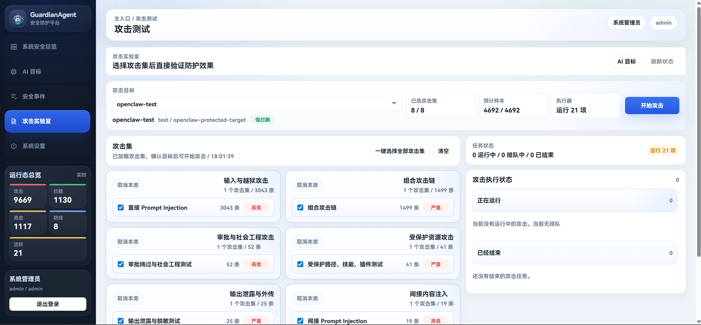
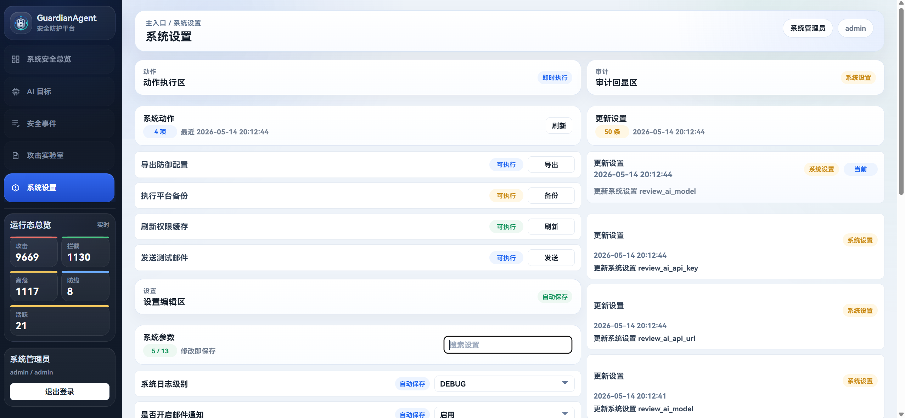

# GuardianAgent

> 一套面向 Function-Calling Agent 的多维蓝队防御与评估平台

GuardianAgent 不是一个“再做一层聊天页面”的项目，而是一套放在 AI / Agent 前面的安全接入与治理平台。  
它的核心目标很直接：**把分散接入的 AI 统一纳管，把高风险调用提前拦住，把安全事件完整留痕，把每一个接入目标单独治理。**

---

## 项目概述

用最简单的大白话说，这个项目解决的是一个很多团队都会遇到的问题：

当 AI、Agent、Function Calling、插件、MCP 工具逐步接入业务之后，真正麻烦的往往不是“模型能不能用”，而是：

- 请求直接打到上游模型，没有统一安全入口
- 每个 AI 的接入方式不同，后面越接越乱
- Prompt Injection、危险工具调用、敏感目录访问、越权执行，很难统一拦截
- 出了问题只能翻日志，缺少真正可用的安全事件和报告
- 不同 AI 目标无法单独配置规则、单独做防护、单独做扫描和治理

GuardianAgent 做的事情，就是把这些问题集中解决掉：

- 在所有 AI / Agent 前面放一个统一的安全网关
- 把聊天、工具调用、MCP 调用等高风险流量先纳入审查
- 把每一个接入的 AI 单独展示、单独配置、单独治理
- 把防御规则、Skill 扫描、事件处置、报告导出整合成一套完整工作流
- 支持客户端注册、短期激活码换长期凭据、后续本地复用的接入方式

一句话概括：

**GuardianAgent 面向的不是“模型能力增强”，而是“AI 进入生产之后，如何被安全地接入、管住、审计和验证”。**

---

## 项目当前完成度

当前版本已经具备完整演示、联调和持续扩展能力，整体更接近一个**可运行的 Beta 原型**，而不是概念展示。

- 如果以“本地跑通、功能演示、联调验证、核心流程闭环”为标准，当前完成度约为 **75% - 80%**
- 如果以“直接进入大规模生产环境”为标准，当前完成度约为 **55% - 60%**

目前已经完成的重点部分包括：

- 统一安全接入网关
- 多 AI / Agent 目标管理
- 面向单个目标的独立策略治理
- 安全事件记录、查看、处置与报告导出
- Skill 管理、导入、扫描、信任状态联动
- 敏感目录与关键资产保护
- OpenClaw 接入保护与运行时联动
- 短期激活码注册、长期凭据复用的客户端接入流程

仍在持续完善的方向包括：

- 更强的生产级可用性与隔离能力
- 更成熟的任务调度与后台执行架构
- 更细粒度的权限边界与运维能力
- 更完整的自动化测试、观测和报告体系

---

## 展示图片与功能介绍

### 1. 多维防御流水线



这张图概括了平台的核心工作方式：  
所有进入受保护 AI / Agent 的请求，都会依次经过输入审查、上下文审计、身份与权限、Tool / MCP 约束、参数与 Scope 校验、输出净化、会话与速率控制，以及最终的审计留痕与研判。

### 2. 安全仪表盘



首页用于快速回答三个问题：现在风险态势怎样、最近有哪些高频攻击、当前有哪些会话和事件需要优先处理。  
它把运行态总览、趋势、重点风险面和最近联动会话集中到一个视图里，适合作为日常总览和汇报入口。

### 3. AI 目标治理与 OpenClaw 接入



平台会把每一个接入目标单独展示出来，并围绕它提供完整治理入口。  
管理员可以在这里创建 OpenClaw 目标、生成客户端激活码、查看 Runtime 绑定状态，并直接进入接入配置、攻击测试、Skill / 目录 / MCP 策略等治理动作。

### 4. 安全事件处置



这里聚焦的是“已经发生的事”。  
事件中心支持按状态筛选、批量拦截或放行、查看单条事件详情，并关联命中的控制面、规则和信号，方便快速判断是 Prompt Injection、MCP 投毒、越权调用还是输出泄露类风险。

### 5. 攻击实验室



攻击实验室不是静态样本列表，而是可以真正对指定 AI 目标发起验证。  
平台支持按攻击类别整体选择样本集，直接对受保护目标执行测试，并在右侧实时查看任务状态，便于验证规则是否生效、拦截是否到位。

### 6. 系统设置与运维动作



系统设置页提供平台级运维入口。  
这里可以执行导出防御配置、平台备份、权限缓存刷新、测试通知等动作，也可以管理用于辅助研判的系统级接口参数，适合作为日常维护和环境管理入口。

---

## 已完成的核心能力

- 统一 AI 安全接入入口，避免上游模型裸暴露
- 针对每个 AI 目标进行单独治理，而不是全局共用一套配置
- 对聊天、工具调用、MCP 相关流量进行前置审查
- 记录安全事件、展示命中结果，并形成可复盘的证据链
- 支持 Skill 目录导入、Skill 扫描、信任状态联动
- 支持敏感目录、关键资源、受保护 Skill 的策略化管理
- 支持 OpenClaw 这类运行时形态的接入保护
- 支持客户端激活码接入与长期凭据复用
- 支持攻击测试、效果验证与安全报告输出

---

## 适用场景

- 企业内部正在逐步接入多个 AI / Agent，希望先把入口和风控统一起来
- 团队已经使用 Function Calling、插件或 MCP，希望对高风险调用建立审查与约束
- 需要对不同业务线、不同 AI 目标做差异化安全治理
- 需要一个既能演示、也能联调、还能持续扩展的 AI 安全平台底座

---

## 快速开始

### 1. 准备环境变量

```powershell
Copy-Item .env.example .env
```

### 2. 启动项目

```powershell
.\start.ps1
```

如果依赖已经安装完成：

```powershell
.\start.ps1 -SkipInstall
```

默认地址：

- 前端：`http://127.0.0.1:5173`
- 后端：`http://127.0.0.1:8000`
- OpenAPI：`http://127.0.0.1:8000/docs`
- 健康检查：`http://127.0.0.1:8000/health`

默认开发账号：

- `admin / admin123`
- `analyst / analyst123`

---

## 接入要防御的 Agent

GuardianAgent 的接入逻辑不是“把上游模型地址填进平台就结束”，而是让真实业务流量先经过本地前置网关或桥接器，再进入平台审查和上游 Agent。

### 1. 管理端先准备目标

在平台里，管理员先完成两件事：

1. 创建一个要保护的 AI 目标。
2. 为该目标生成一次性激活码或 Enrollment Token。

这样做的好处是：

- 客户端不需要拿到平台管理权限
- 长期凭据不会在管理端和用户之间反复传递
- 首次接入后可以落本地复用，后续无需重复录入

### 2. 接入通用 HTTP / OpenAI-Compatible Agent

如果你要保护的是标准 HTTP JSON Agent、OpenAI 兼容接口、Dify 类接口或自研 Function-Calling 服务，可以直接运行：

Windows：

```powershell
.\connect_agent_gateway.cmd
```

Linux / macOS：

```bash
sh ./connect_agent_gateway.sh
```

脚本会引导输入：

- 平台地址
- 上游 Agent 地址
- 上游鉴权信息
- 激活码或 Enrollment Token

首次成功后，脚本会在 `tools/agent_gateway/generated/` 下生成本地配置。  
后续业务侧应改为访问脚本启动后的本地前置网关地址，而不是继续直连真实上游。

对应链路是：

```text
调用方 -> 本地前置网关 -> GuardianAgent 平台审查 -> 放行后转发到真实 Agent
```

### 3. 接入 OpenClaw 控制台 / Runtime Agent

如果你要保护的是 OpenClaw Control UI、WebSocket Runtime 会话或带 Tool / MCP 调用的 OpenClaw 目标，使用独立桥接脚本：

Windows：

```powershell
.\connect_openclaw_control.cmd
```

Linux / macOS：

```bash
sh ./connect_openclaw_control.sh
```

典型输入包括：

- 平台地址
- OpenClaw 上游地址
- OpenClaw gateway token
- 激活码或 Enrollment Token
- 本地桥接监听地址

首次接入成功后，脚本会输出一个本地访问地址，形如：

```text
http://127.0.0.1:19090/?gatewayUrl=ws://127.0.0.1:19090&token=<gateway-token>
```

后续必须打开这个本地桥接地址，而不是直连原始 OpenClaw 地址。  
只有这样，聊天、工具调用、MCP 能力请求和运行态事件才会真正进入平台的防护链路。

### 4. 平台在接入后会做什么

当 Agent 通过前置网关或 OpenClaw 桥接器接入后，平台会对流量执行：

- 输入与上下文审查
- Tool / MCP 能力边界校验
- 参数与 Scope 合法性检查
- 输出脱敏、阻断或改写
- 审计留痕与事件归档
- 攻击实验室验证与效果回看

如果命中高风险规则，平台可以按策略执行：

- 直接拦截
- 标记可疑并进入复核
- 允许放行但完整记录证据链

### 5. 接入后的治理入口

一个目标接入完成后，管理员可以继续在平台里对这个目标做专属治理：

- 接入配置
- Skill / 目录 / 研判联动
- MCP 策略约束
- 攻击测试
- 安全事件查看与报告导出

这也是 GuardianAgent 和“只做代理转发”的区别：  
它不仅接住流量，还把每一个接入目标纳入独立治理和持续验证流程。

---

## 文档入口

- [文档总览](./docs/README.md)
- [后端说明](./backend/README.md)
- [前端说明](./frontend/README.md)
- [统一代理入口实施方案](./docs/platform/统一代理入口实施方案.md)
- [Agent 接入保护脚本说明](./docs/platform/Agent接入保护脚本说明.md)
- [蓝队防御平台工程设计](./docs/platform/蓝队防御平台工程设计.md)
- [蓝队防御平台接口设计文档](./docs/platform/蓝队防御平台接口设计文档.md)

---

## 当前边界

GuardianAgent 目前已经能跑、能演示、能联调，也具备比较完整的核心链路。  
但如果目标是直接面向复杂生产环境大规模上线，仍然需要继续补强高可用、隔离性、调度能力与运维体系。

对当前阶段来说，它已经足够胜任：

- 方案展示
- 原型验证
- 接入联调
- 安全能力演示
- 后续持续迭代的基础底座
