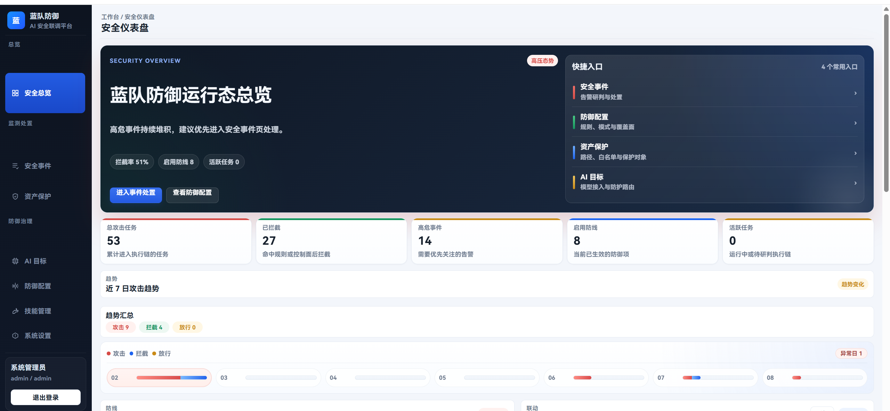
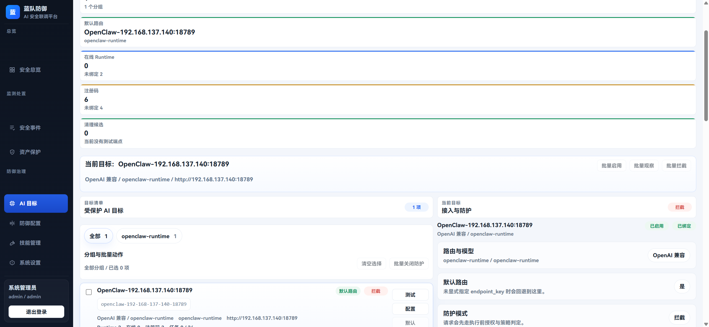
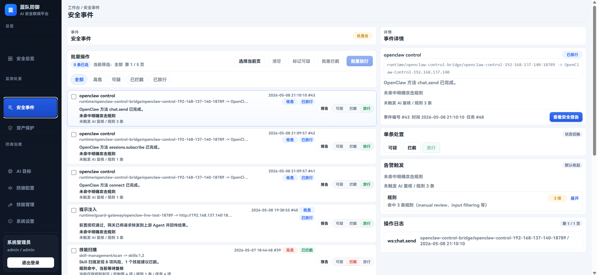
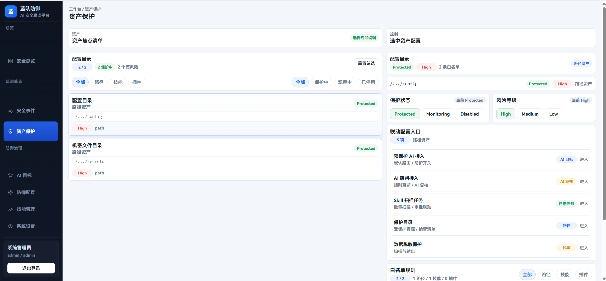
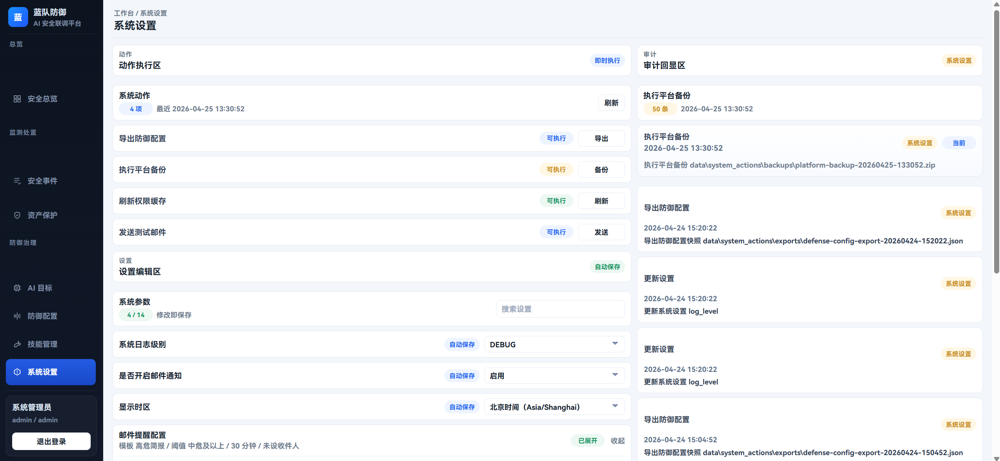

# 蓝队防御管理平台

> 一个放在 AI / Agent 前面的安全网关和管理后台。  
> 它不是做大模型训练的，而是专门解决“AI 接进来以后，怎么统一接入、统一管控、统一审计”的问题。

## 1. 项目概述

### 这个项目是做什么的

用最简单的大白话说：

很多团队把 AI、Agent、OpenAI 兼容接口、各种插件能力接进业务后，最容易出的问题不是“模型能不能跑”，而是：

- 请求是直接打到模型上的，没有一个统一入口。
- 每个 AI 接入方式都不一样，后面越来越乱。
- 出现提示词注入、越权调用、危险路径访问、敏感输出时，没有统一拦截点。
- 出了问题以后，只能靠翻日志，没法快速看到事件、规则、处置过程和报告。
- 没法针对“某一个接入的 AI”单独配规则、单独配技能、单独做治理。

这个项目就是专门解决这些问题的。

它做的事情可以理解成：

1. 在 AI / Agent 前面放一个统一安全入口。
2. 所有请求先过平台，再决定放行、拦截、复核、记录。
3. 把每一个接入的 AI 都单独展示出来，单独做配置和治理。
4. 把安全事件、规则命中、技能扫描、报告导出这些事情全部统一起来。

一句话总结：

**这不是“又一个聊天页面”，而是一套给 AI / Agent 做安全接入和安全运营的管理平台。**

### 这个项目解决什么问题

- 解决 AI 接入分散、没有统一入口的问题。
- 解决 AI 请求缺少前置风控的问题。
- 解决不同 AI 目标无法单独治理的问题。
- 解决技能、插件、路径、权限这类高风险能力无法统一审查的问题。
- 解决安全事件没有沉淀、没有报告、没有证据链的问题。
- 解决客户端注册流程太重、太难分发的问题。

现在项目里已经支持一种更适合落地的接入方式：

- 客户端先填写管理端地址和账号密码。
- 先做一次测试连接。
- 管理端给一个**短期激活码**。
- 客户端输入激活码后，换一次长期凭据。
- 第一次成功以后，后面直接复用本地配置继续连接，不用每次重新填一堆信息。

## 2. 项目当前完成度

### 当前状态

**当前更接近“可运行的 Beta 原型”，不是 PPT，也不是只做了前端页面。**

按我现在对代码和运行结果的判断：

- 如果按“本地跑起来、演示、联调、展示核心能力”来看，完成度大约在 **75% - 80%**。
- 如果按“企业生产环境直接大规模上线”来看，完成度大约在 **55% - 60%**。

### 已完成的部分

- 已完成可运行的前后端项目，不是单纯原型图。
- 已完成多 AI / Agent 目标管理。
- 已完成统一网关接入和运行时回传。
- 已完成防御规则配置、模式切换和策略治理。
- 已完成 Skill 管理、导入、扫描、审批联动。
- 已完成安全事件列表、详情、状态流转和报告查看。
- 已完成资产保护清单和联动配置。
- 已完成系统设置、导出、备份等基础运维能力。
- 已完成运行时接入管理，以及短期激活码换长期凭据的注册流程。
- 已完成“每个接入 AI 单独显示、单独配置、单独治理”的核心方向。

### 还在继续完善的部分

- 还不是完整生产级高可用架构。
- Worker 目前仍以本地/数据库轮询为主，不是完整消息队列架构。
- 运行中任务的暂停/取消仍偏协作式，不是强制中断型控制。
- 生产环境下的更严格权限边界、审计深度、稳定性和部署体系还需要继续补强。
- 报告、自动化运维、观测能力还可以继续做得更完整。

## 3. 展示图片与已完成功能介绍

下面这些图片来自当前项目实际页面，不是设计稿。

### 3.1 安全总览仪表盘



这个页面主要展示：

- 当前平台整体风险态势。
- 最近一段时间的攻击趋势和拦截情况。
- 高危事件、已拦截数量、启用防线数量、活跃任务数量。
- 常用入口导航，能快速进入安全事件、防御配置、资产保护、AI 目标等核心页面。

### 3.2 AI 目标管理



这个页面说明项目已经能做到：

- 把接入进来的 AI / Agent 单独展示出来。
- 给每个 AI 目标设置默认路由、接入方式、防护模式。
- 支持“按目标治理”，而不是全平台只能共用一套规则。
- 为后续做专属规则、专属技能、专属扫描打基础。

### 3.3 安全事件处置



这个页面已经完成的功能包括：

- 展示安全事件列表和状态。
- 查看事件详情、规则命中、操作日志和关联任务。
- 对单条事件做可疑、拦截、放行等处置。
- 支持批量处理，适合安全运营场景。
- 能把规则结果和人工处置放到一个界面里统一看。

### 3.4 资产保护



这个页面主要用于：

- 配置重点保护的路径、目录、技能、插件等对象。
- 设置保护状态和风险等级。
- 把资产保护和 AI 接入、AI 研判、Skill 扫描做联动。
- 让“高风险目录 / 关键资产”不只是写在文档里，而是真正进入治理流程。

### 3.5 系统设置与运维动作



这个页面说明项目已经有基础运维能力：

- 导出防御配置。
- 执行平台备份。
- 刷新权限缓存。
- 配置系统参数并自动保存。
- 记录系统动作审计信息。

## 当前已经完成的核心能力

- 统一安全网关：让模型请求先过平台，再进真实 AI / Agent。
- 多目标 AI 管理：一个平台里管理多个 AI 目标，不再只靠单一 `.env`。
- 按目标做专属治理：不同 AI 可以有不同防护规则和技能策略。
- 安全事件中心：规则命中、状态变化、报告查看、人工处置全部统一。
- Skill 治理：支持导入、扫描、审批、信任状态管理。
- 资产保护：把路径、目录、关键对象纳入治理。
- 报告导出：支持把执行结果和安全结论沉淀下来。
- 客户端注册优化：短期激活码换长期凭据，首次注册成功后可直接复用本地配置。

## 快速开始

### 1. 准备环境变量

```powershell
Copy-Item .env.example .env
```

### 2. 一键启动

```powershell
.\start.ps1
```

如果依赖已经装好：

```powershell
.\start.ps1 -SkipInstall
```

默认地址：

- 前端：`http://127.0.0.1:5173`
- 后端：`http://127.0.0.1:8000`
- OpenAPI：`http://127.0.0.1:8000/docs`
- 健康检查：`http://127.0.0.1:8000/health`

默认开发账号：

- `admin / admin123`
- `analyst / analyst123`

## Agent 接入

### Windows

```powershell
.\connect_agent_gateway.cmd
```

### Linux / macOS

```bash
sh ./connect_agent_gateway.sh
```

## 文档入口

- [文档总览](./docs/README.md)
- [后端说明](./backend/README.md)
- [前端说明](./frontend/README.md)
- [统一代理入口实施方案](./docs/platform/统一代理入口实施方案.md)
- [Agent 接入保护脚本说明](./docs/platform/Agent接入保护脚本说明.md)
- [蓝队防御平台工程设计](./docs/platform/蓝队防御平台工程设计.md)
- [蓝队防御平台接口设计文档](./docs/platform/蓝队防御平台接口设计文档.md)

## 当前边界

- 这个项目已经能跑、能演示、能联调，但还不是最终企业生产版。
- 目前更适合用于方案展示、内部验证、联调集成和持续扩展。
- 如果要正式对外商用，还需要继续补齐高可用、强隔离、部署体系和更完整的生产级安全治理能力。
