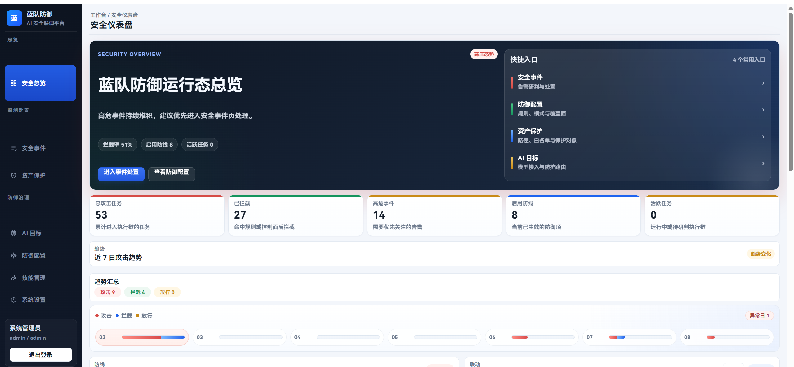
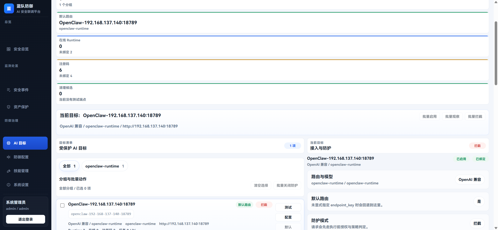
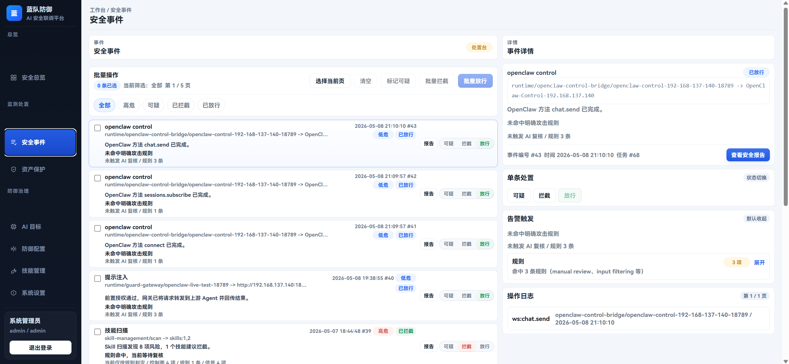
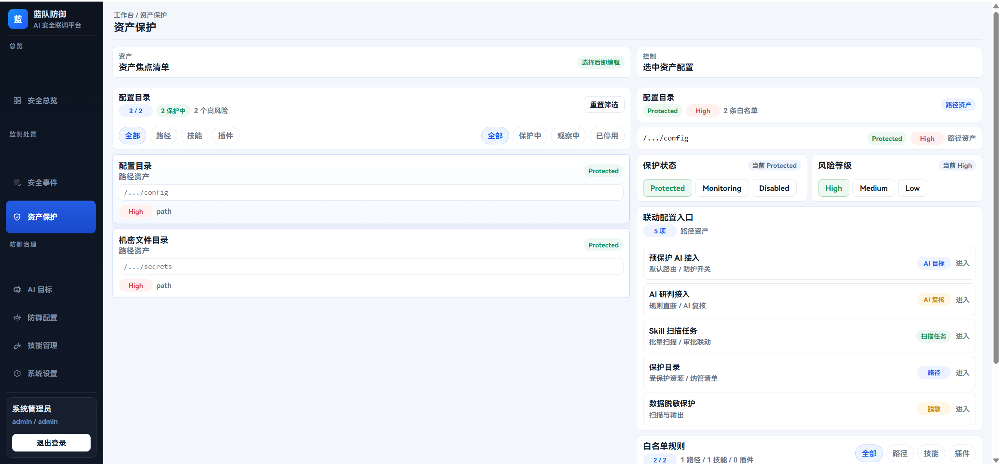
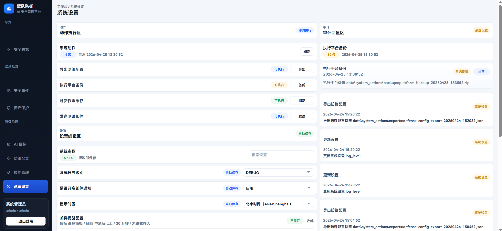

# GuardianAgent

> 一套面向 Function-Calling Agent 的多维蓝队防御与评估平台

GuardianAgent 不是一个“再做一层聊天页面”的项目，而是一套放在 AI / Agent 前面的安全接入与治理平台。  
它的核心目标很直接：**把分散接入的 AI 统一纳管，把高风险调用提前拦住，把安全事件完整留痕，把每一个接入目标单独治理。**

---

## 项目概述

用最简单的大白话说，这个项目解决的是一个很多团队都会遇到的问题：

当 AI、Agent、Function Calling、插件、MCP 工具逐步接入业务之后，真正麻烦的往往不是“模型能不能用”，而是：

- 请求直接打到上游模型，没有统一安全入口
- 每个 AI 的接入方式不同，后面越接越乱
- Prompt Injection、危险工具调用、敏感目录访问、越权执行，很难统一拦截
- 出了问题只能翻日志，缺少真正可用的安全事件和报告
- 不同 AI 目标无法单独配置规则、单独做防护、单独做扫描和治理

GuardianAgent 做的事情，就是把这些问题集中解决掉：

- 在所有 AI / Agent 前面放一个统一的安全网关
- 把聊天、工具调用、MCP 调用等高风险流量先纳入审查
- 把每一个接入的 AI 单独展示、单独配置、单独治理
- 把防御规则、Skill 扫描、事件处置、报告导出整合成一套完整工作流
- 支持客户端注册、短期激活码换长期凭据、后续本地复用的接入方式

一句话概括：

**GuardianAgent 面向的不是“模型能力增强”，而是“AI 进入生产之后，如何被安全地接入、管住、审计和验证”。**

---

## 项目当前完成度

当前版本已经具备完整演示、联调和持续扩展能力，整体更接近一个**可运行的 Beta 原型**，而不是概念展示。

- 如果以“本地跑通、功能演示、联调验证、核心流程闭环”为标准，当前完成度约为 **75% - 80%**
- 如果以“直接进入大规模生产环境”为标准，当前完成度约为 **55% - 60%**

目前已经完成的重点部分包括：

- 统一安全接入网关
- 多 AI / Agent 目标管理
- 面向单个目标的独立策略治理
- Redis 优先缓存与内存回退
- HTTP / WebSocket 入口安全加固
- 安全事件记录、查看、处置与报告导出
- Skill 管理、导入、扫描、信任状态联动
- 敏感目录与关键资产保护
- OpenClaw 接入保护与运行时联动
- 短期激活码注册、长期凭据复用的客户端接入流程
- MCP 执行票据、Runtime 授权、心跳与结果回传
- JSON / HTML / DOCX 报告导出和批量打包

仍在持续完善的方向包括：

- 更强的生产级可用性与隔离能力
- 更成熟的任务调度与后台执行架构
- 更细粒度的权限边界与运维能力
- 更完整的自动化测试、观测和报告体系

---

## 展示图片与功能介绍

### 1. 系统安全总览



这一页主要用于回答三个问题：当前整体风险怎样、最近发生了什么、哪些地方最值得优先关注。  
它把核心指标、风险趋势、拦截情况和常用入口集中到一个页面里，适合作为日常总览和汇报入口。

### 2. AI 目标管理



平台会把每一个接入的 AI / Agent 单独展示出来，而不是混在一堆配置里。  
管理员可以围绕单个目标做专属配置，包括接入方式、保护策略、Skill 管理、运行时绑定和后续治理。

### 3. 安全事件中心



这里聚焦的是“已经发生的事”。  
所有命中的安全事件都会沉淀下来，支持查看状态、查看详情、跟踪规则命中、关联任务和后续处置，适合安全运营和问题复盘。

### 4. 资产与 Skill 保护



这一部分的重点不是做静态展示，而是把关键路径、敏感目录、Skill、插件等高风险对象真正纳入治理。  
它让“哪些资源不能碰、哪些能力需要重点关注”这件事从文档要求，变成了平台里的实际配置。

### 5. 系统设置与运维操作



系统设置页提供的是平台层面的基础运维能力。  
包括配置管理、部分系统参数维护、缓存刷新、备份导出等，方便把平台作为一个长期可维护的系统来使用。

---

## 当前工程状态

当前代码已经落地以下工程能力：

- 网关入口：`/gateway/v1/chat/completions`、`/gateway/v1/responses`、`/gateway/v1/agents/run` 及对应 WebSocket 入口。
- Runtime 链路：注册申请、激活码换长期凭据、命令轮询、授权、心跳和完成回传。
- MCP 治理：按 AI 目标管理 MCP Server / Capability 策略，并通过一次性执行票据约束任务、运行时、会话、scope 和参数摘要。
- 缓存层：默认 Redis 优先，Redis 不可用时自动回退到内存缓存；健康检查会暴露当前有效缓存后端。
- 安全加固：请求体和 WebSocket 消息大小限制、登录与公开 Runtime 注册限流、Trusted Host、响应安全头、敏感查询参数和验证错误脱敏。
- 报告闭环：报告支持 JSON / HTML / DOCX 导出，批量下载会生成归档包与 manifest。

当前自动化测试收集 `57` 项。最近一次完整执行 `python -m pytest backend/tests -q` 的结果为 `56 passed, 1 failed, 4 warnings`。唯一失败来自全面并发专项测试在 `100` 并发级别下触发 SQLite `database is locked`，说明本地 SQLite 测试环境不能代表生产级高写入并发能力；常规功能链路、安全加固、Runtime、MCP、OpenClaw、规则质量和报告导出测试已通过。

---

## 已完成的核心能力

- 统一 AI 安全接入入口，避免上游模型裸暴露
- 针对每个 AI 目标进行单独治理，而不是全局共用一套配置
- 对聊天、工具调用、MCP 相关流量进行前置审查
- 记录安全事件、展示命中结果，并形成可复盘的证据链
- 支持 Skill 目录导入、Skill 扫描、信任状态联动
- 支持敏感目录、关键资源、受保护 Skill 的策略化管理
- 支持 OpenClaw 这类运行时形态的接入保护
- 支持客户端激活码接入与长期凭据复用
- 支持攻击测试、效果验证与安全报告输出
- 支持 Redis 缓存、权限缓存刷新和报告产物安全下载

---

## 适用场景

- 企业内部正在逐步接入多个 AI / Agent，希望先把入口和风控统一起来
- 团队已经使用 Function Calling、插件或 MCP，希望对高风险调用建立审查与约束
- 需要对不同业务线、不同 AI 目标做差异化安全治理
- 需要一个既能演示、也能联调、还能持续扩展的 AI 安全平台底座

---

## 快速开始

### 1. 准备环境变量

```powershell
Copy-Item .env.example .env
```

### 2. 启动项目

```powershell
.\start.ps1
```

如果依赖已经安装完成：

```powershell
.\start.ps1 -SkipInstall
```

默认地址：

- 前端：`http://127.0.0.1:5173`
- 后端：`http://127.0.0.1:8000`
- OpenAPI：`http://127.0.0.1:8000/docs`
- 健康检查：`http://127.0.0.1:8000/health`

默认开发账号：

- `admin / admin_123`
- `analyst / analyst123`

---

## 文档入口

- [文档总览](./docs/README.md)
- [后端说明](./backend/README.md)
- [前端说明](./frontend/README.md)
- [统一代理入口实施方案](./docs/platform/统一代理入口实施方案.md)
- [Agent 接入保护脚本说明](./docs/platform/Agent接入保护脚本说明.md)
- [蓝队防御平台工程设计](./docs/platform/蓝队防御平台工程设计.md)
- [蓝队防御平台接口设计文档](./docs/platform/蓝队防御平台接口设计文档.md)

---

## 当前边界

GuardianAgent 目前已经能跑、能演示、能联调，也具备比较完整的核心链路。  
但如果目标是直接面向复杂生产环境大规模上线，仍然需要继续补强高可用、隔离性、调度能力与运维体系。
特别是高强度写入并发场景，建议使用 PostgreSQL 等服务型数据库进行验证；本地 SQLite 更适合开发、演示和小规模回归。

对当前阶段来说，它已经足够胜任：

- 方案展示
- 原型验证
- 接入联调
- 安全能力演示
- 后续持续迭代的基础底座
